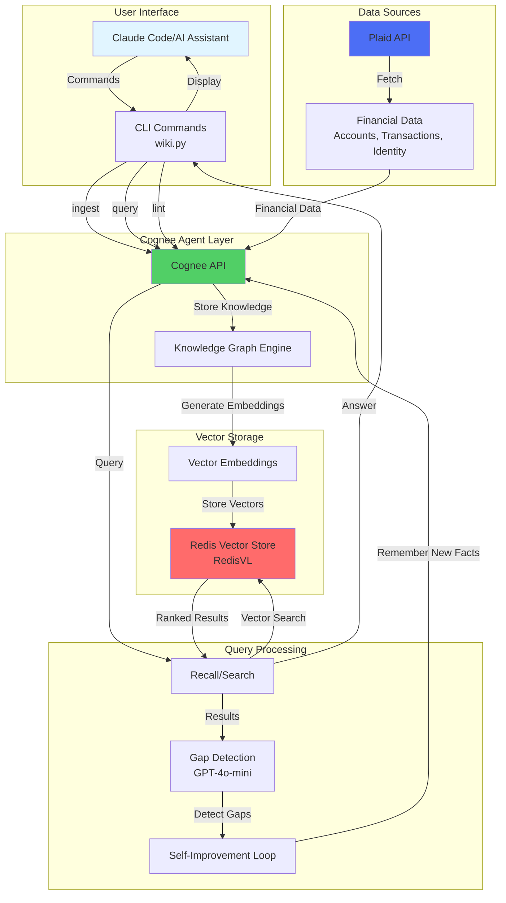

# Architecture

This diagram shows the flow of data through the Cognee Wiki system with Plaid integration and Redis vector storage.

## Data Flow

### Ingestion Flow
1. **User/Claude** initiates ingestion via CLI (`wiki ingest`)
2. **Plaid Client** fetches financial data (accounts, transactions, identity)
3. **Cognee Agent** processes and structures the data
4. **Knowledge Graph Engine** creates semantic relationships
5. **Redis Vector Store** stores vector embeddings for semantic search

### Query Flow
1. **User/Claude** asks a question via CLI (`wiki query "question"`)
2. **Cognee Recall** performs semantic search against Redis VL
3. **Vector Search** returns ranked relevant knowledge chunks
4. **Gap Detection** analyzes if answer is complete using GPT-4o-mini
5. **Self-Improvement** automatically fills knowledge gaps if detected
6. **Results** returned to user with enriched context

### Skills Management
1. **Skills List/Show/Install** commands manage agent capabilities
2. **Plaid Skill** provides reference documentation and examples
3. **Skills** can be installed to `.claude/skills` or `.agents/skills`

## Technology Stack

- **CLI Framework**: Click
- **Knowledge Management**: Cognee
- **Vector Database**: Redis with RedisVL
- **Data Source**: Plaid Python SDK
- **Gap Detection**: OpenAI GPT-4o-mini
- **Code Quality**: Black formatter
