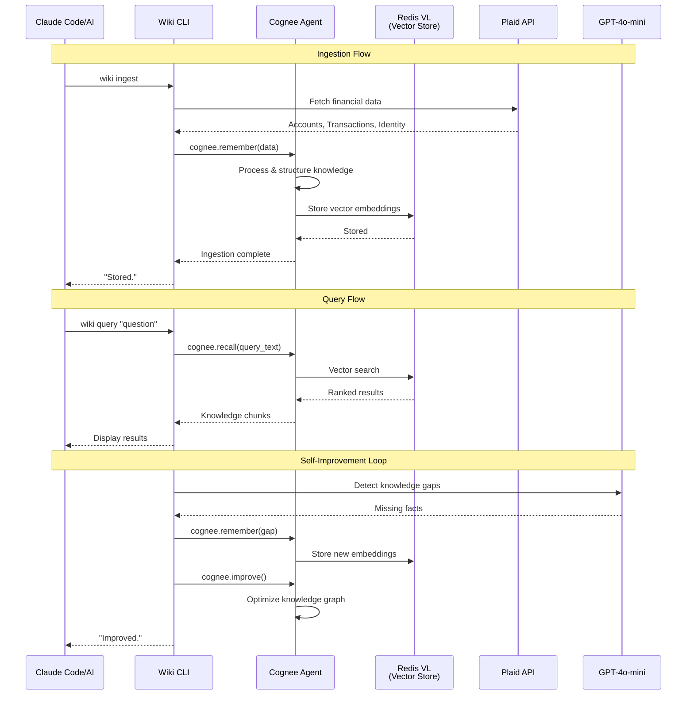

```mermaid
sequenceDiagram
    participant Claude as Claude Code/AI
    participant CLI as Wiki CLI
    participant Cognee as Cognee Agent
    participant Redis as Redis VL<br/>(Vector Store)
    participant Plaid as Plaid API
    participant GPT as GPT-4o-mini

    Note over Claude,GPT: Ingestion Flow
    Claude->>CLI: wiki ingest
    CLI->>Plaid: Fetch financial data
    Plaid-->>CLI: Accounts, Transactions, Identity
    CLI->>Cognee: cognee.remember(data)
    Cognee->>Cognee: Process & structure knowledge
    Cognee->>Redis: Store vector embeddings
    Redis-->>Cognee: Stored
    Cognee-->>CLI: Ingestion complete
    CLI-->>Claude: "Stored."

    Note over Claude,GPT: Query Flow
    Claude->>CLI: wiki query "question"
    CLI->>Cognee: cognee.recall(query_text)
    Cognee->>Redis: Vector search
    Redis-->>Cognee: Ranked results
    Cognee-->>CLI: Knowledge chunks
    CLI-->>Claude: Display results
    
    Note over Claude,GPT: Self-Improvement Loop
    CLI->>GPT: Detect knowledge gaps
    GPT-->>CLI: Missing facts
    CLI->>Cognee: cognee.remember(gap)
    Cognee->>Redis: Store new embeddings
    CLI->>Cognee: cognee.improve()
    Cognee->>Cognee: Optimize knowledge graph
    CLI-->>Claude: "Improved."
```
